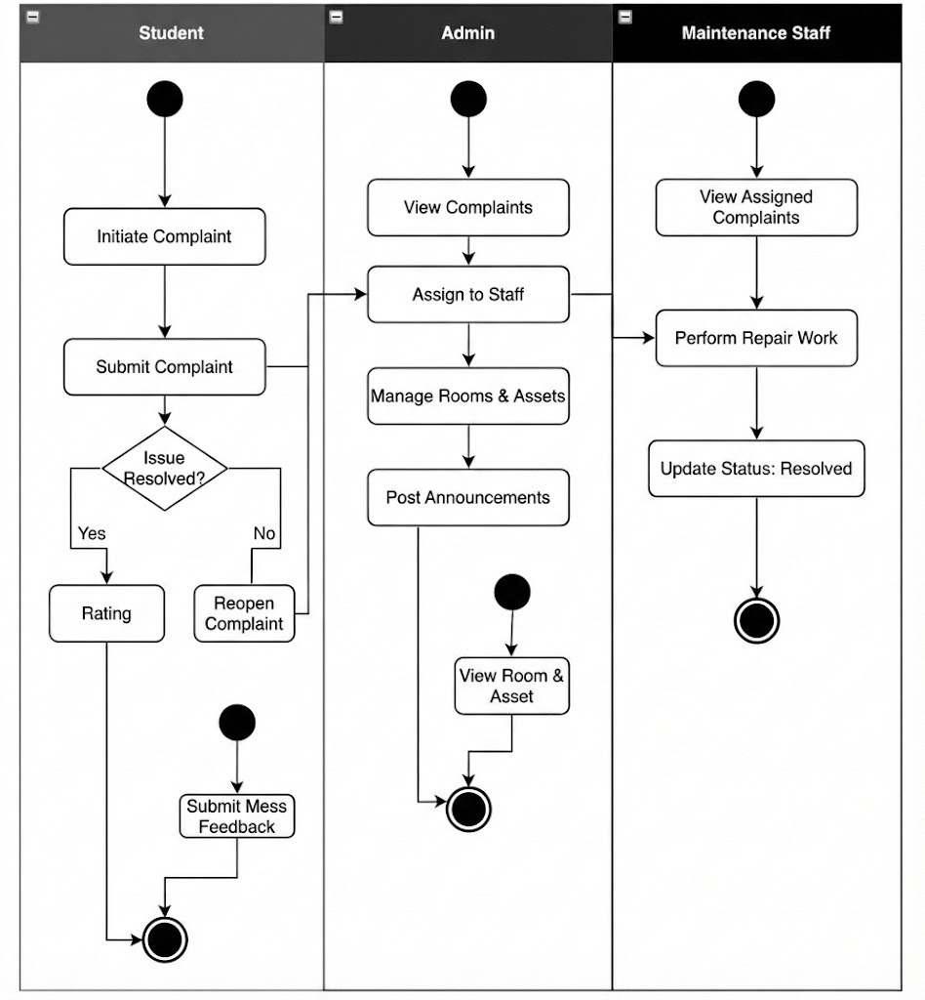

## Strategic Rationale Diagram

## Use Case Diagram

## Activity Diagram

## System Architecture & Tech Stack

### Overview
- **Backend Language:** Typescript (Node.js)
- **Backend Framework:** Fastify (better than Express)
- **Database:** PostgreSQL
- **Database Host:** Docker
- **Database Driver:** node-pg
- **Frontend:** React + Vite

### Technology Justification

| Component | Choice | Technical Justification |
|-----------|--------|-------------------------|
| Language | TypeScript | Type safety and strict contract adherence between API and DB models. |
| Runtime | Node.js (v20+) | Asynchronous, event-driven architecture suitable for I/O-heavy operations (DB queries). |
| Framework | Fastify | Low-overhead, high-performance framework. Selected to minimize latency in request processing compared to Express. |
| Database | PostgreSQL | Chosen for strict ACID compliance, MVCC (Concurrency), and support for complex Stored Procedures compared to MySql |
| DB Interaction | node-postgres | Raw SQL Driver. No ORM used. Allows for manual query optimization, explicit indexing, and transaction management. |
| Infrastructure | Docker | Containerized database instance ensures environment consistency and isolation from the host OS. |
| Frontend | React + Vite | Client-Side Rendering (CSR) architecture. Decoupled from the backend to simulate a real-world Microservices setup. |