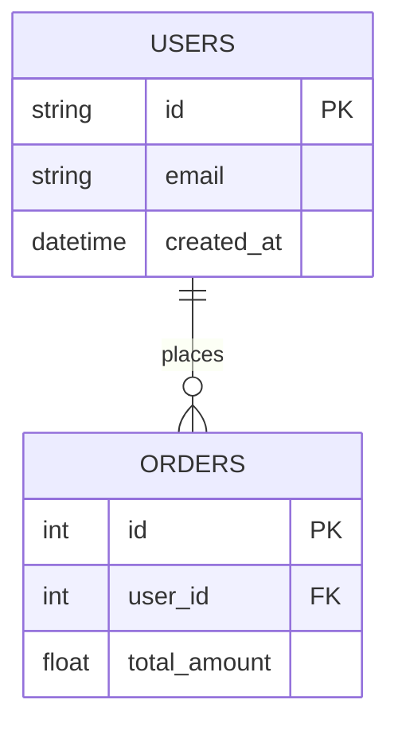

## ER Diagram

## DB Schema

### Schema

```mermaid
erDiagram
    USERS ||--o{ ORDERS : places
    USERS {
        string id PK
        string email
        datetime created_at
    }
    ORDERS {
        int id PK
        int user_id FK
        float total_amount
    }
```