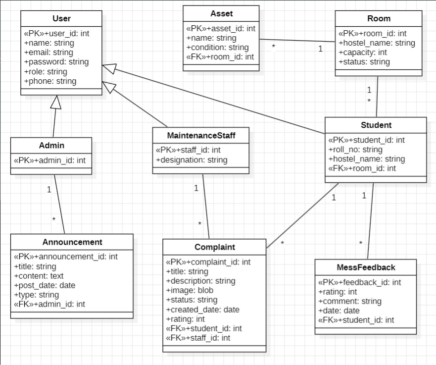

## ER Diagram



## DB Schema

### Entity-Relationship Diagram (Mermaid)

```mermaid
erDiagram
    AUTH ||--|| USERS : "1:1 (PK=FK)"
    USERS ||--o| ADMIN : "ISA"
    USERS ||--o| STUDENT : "ISA"
    USERS ||--o| MAINTENANCE_STAFF : "ISA"
    HOSTELS ||--o{ ROOMS : "has"
    HOSTELS ||--o{ STUDENT : "resides_in"
    ROOMS ||--o{ STUDENT : "assigned_to"
    STUDENT ||--o{ COMPLAINTS : "registers"
    STUDENT ||--o{ MESS_FEEDBACK : "submits"
    MAINTENANCE_STAFF ||--o{ COMPLAINTS : "assigned_to"
    ADMIN ||--o{ ANNOUNCEMENTS : "publishes"
    COMPLAINT_IMAGES ||--o| COMPLAINTS : "attached_to"

    AUTH {
        uuid id PK "UUIDv7"
        text user_name UK
        text password_hash
        timestamptz created_at
        timestamptz updated_at
    }
    USERS {
        uuid id PK_FK "→ auth(id) CASCADE"
        text user_name FK "→ auth(user_name) CASCADE"
        varchar name
        text email UK
        text user_role "CHECK: student|admin|staff"
        text phone
    }
    ADMIN {
        uuid admin_id PK_FK "→ users(id) CASCADE"
    }
    STUDENT {
        uuid student_id PK_FK "→ users(id) CASCADE"
        varchar roll_no UK
        text hostel_name FK "→ hostels CASCADE"
        uuid room_id FK "→ rooms SET NULL"
    }
    MAINTENANCE_STAFF {
        uuid staff_id PK_FK "→ users(id) CASCADE"
        text designation
    }
    HOSTELS {
        uuid hostel_id PK "UUIDv7"
        text hostel_name UK
        text location
        integer capacity
    }
    ROOMS {
        uuid room_id PK "UUIDv7"
        text hostel_name FK "→ hostels CASCADE"
        varchar room_number
        integer room_capacity
        text status "CHECK: available|full|maintenance"
    }
    COMPLAINTS {
        uuid complaint_id PK "UUIDv7"
        uuid student_id FK "→ student SET NULL"
        text title
        text details
        uuid image_id FK "→ complaint_images SET NULL"
        text category
        text urgency_level "CHECK: low|normal|high|critical"
        text status "CHECK: pending|in_progress|resolved"
        timestamptz created_at
        timestamptz updated_at "TRIGGER: auto-updated"
        uuid assigned_staff_id FK "→ maintenance_staff SET NULL"
        integer rating "CHECK: 1-5"
    }
    COMPLAINT_IMAGES {
        uuid image_id PK "UUIDv7"
        bytea image
    }
    ANNOUNCEMENTS {
        uuid announcement_id PK "UUIDv7"
        uuid admin_id FK "→ admin SET NULL"
        text title
        text content
        text announcement_type "CHECK: Maintenance|Event|Mess_Notice|Holiday|General"
        timestamptz posted_date
    }
    MESS_FEEDBACK {
        uuid feedback_id PK "UUIDv7"
        uuid student_id FK "→ student SET NULL"
        integer rating "CHECK: 1-5"
        text comments
        timestamptz created_at "UNIQUE INDEX: (student_id, date)"
    }
```

### Views

| View Name | Purpose |
|-----------|---------|
| `v_complaint_dashboard` | Aggregated complaint stats per status |
| `v_student_complaints` | Complaint rows enriched with student details |
| `v_daily_mess_report` | Daily aggregated mess feedback |

### Stored Procedures

| Function | Parameters | Returns |
|----------|-----------|---------|
| `get_hostel_complaint_report(hostel_name)` | Hostel name | Per-category complaint stats |
| `update_modified_timestamp()` | — | Trigger function for auto-updating `updated_at` |

### Triggers

| Trigger | Table | Event | Purpose |
|---------|-------|-------|---------|
| `trg_complaints_updated` | complaints | BEFORE UPDATE | Auto-set `updated_at` |
| `trg_auth_updated` | auth | BEFORE UPDATE | Auto-set `updated_at` |

### Indexes

| Index | Table(Column) | Type |
|-------|--------------|------|
| `idx_complaints_student` | complaints(student_id) | B-tree |
| `idx_complaints_status` | complaints(status) | B-tree |
| `idx_complaints_staff` | complaints(assigned_staff_id) | B-tree |
| `idx_complaints_created` | complaints(created_at DESC) | B-tree |
| `idx_feedback_student` | mess_feedback(student_id) | B-tree |
| `idx_feedback_date` | mess_feedback(created_at DESC) | B-tree |
| `idx_announcements_date` | announcements(posted_date DESC) | B-tree |
| `idx_student_hostel` | student(hostel_name) | B-tree |
| `idx_unique_feedback_per_day` | mess_feedback(student_id, date) | B-tree (UNIQUE, functional) |